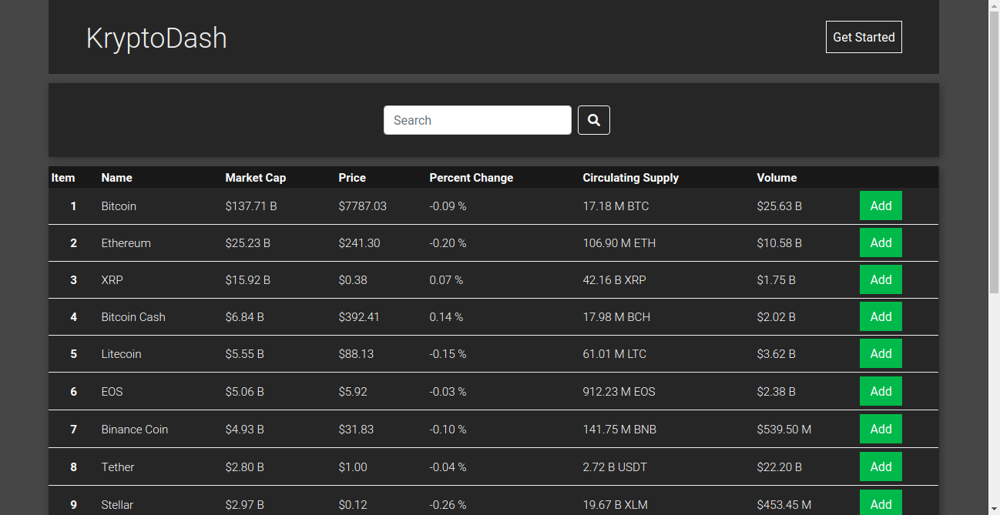

# KryptoDash


[KryptoDash](https://krypto-dash.herokuapp.com/) is a cryptocurrencty tracking application that allows users to monitor updates and trends relating to coins of interest on the market.

## Table of Contents
1. [Getting Started](#getting-started)
2. [Technology](#technology)
3. [Installation](#installation)
4. [Features](#features)
5. [Contributing](#contributing)
6. [Author](#author)
7. [License](#license)

## Getting Started

Initial conditions to get the most out of the code provided.

* Package Manager - [NPM](https://nodejs.org/en/)
* Code Editor - [VS Code](https://code.visualstudio.com/), [Atom](https://atom.io/), [Sublime Text](https://www.sublimetext.com/), etc.
* Operating System - MAC OS, Windows or any Linux Distro
* Modern Browser - [Google Chrome](https://www.google.com/chrome/) or [Firefox](https://www.mozilla.org/en-US/firefox/new/)

## Technology

**_MongoDB_**: NoSQL database used to store user, coin and session data <br>
**_Express_**: Node based server-side microframework used to whip up quick server and create REST API <br>
**_React_**: Client-side framework used to compartmentalize and control various aspects of UI <br>
**_Redux_**: Global client state management <br>
**_Next_**: Server-side render react. Unify react and express <br>
**_Nivo_**: Charting framework built on D3 used to render chart from server-side <br>

View the [package.json](https://github.com/bryanjeanty/kryptodash/blob/master/package.json) to see additional technology used.

## Installation

* Initialize node project

```bash
npm init -y
```

* Install main tech stack

```bash
npm install next@8.1.0 react@16.8.6 react-dom@16.8.6 express@4.16.4 mongoose@5.5.5 @nivo/line@0.58.0
```

* Go to [CoinMarketCap](https://coinmarketcap.com/api/) API main site and register for an API Key

* Go to [CryptoCompare](https://min-api.cryptocompare.com/) API main site and register for an API Key

## Features

* Authentication
* Sessions
* Cryptocurrency Market Data
* Specific Coin Monitoring
* Dashboard
* Coin Historical Data Visualization
* Fuzzy searching

## Contributing

Pull requests are welcome. For major changes, please open an issue first to discuss what you would like to change.
Please read [CONTRIBUTING.md](https://github.com/bryanjeanty/kryptodash/blob/master/CONTRIBUTING.md) for details on the process for submitting pull requests.

## Author

* **Bryan Jeanty**

## License

Project licensed under [MIT](https://github.com/bryanjeanty/kryptodash/blob/master/LICENSE.md) License
